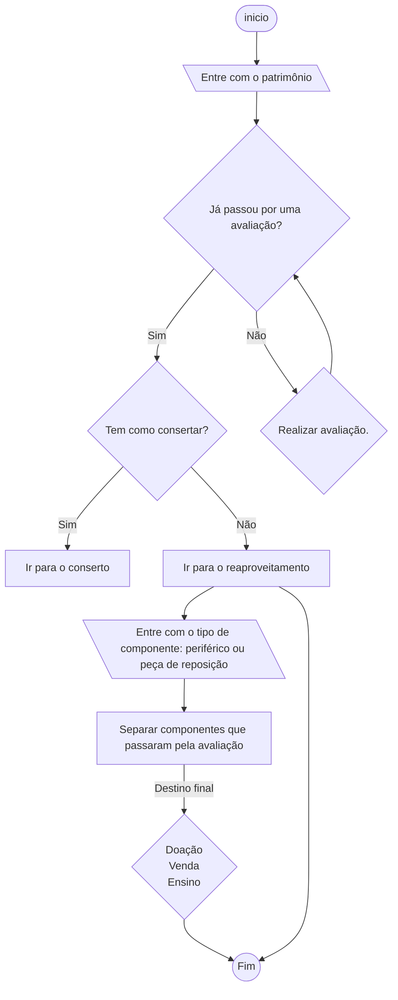

```mermaid
    flowchart TD

        start([inicio]) --> input[\Entre com o patrimônio\] 

        input --> verification{Já passou por uma avaliação?}

        verification --> |Sim| verification2{Tem como consertar?}
        verification --> |Não| avaliation{Realizar avaliação.}
        verification2 --> |Sim| conserto[Ir para o conserto]
        verification2 --> |Não| reaproveito[Ir para o reaproveitamento]
        avaliation --> verification
        reaproveito --> components[\Entre com o tipo de componente: periférico ou peça de reposição\]
        components --> separar[Separar componentes que passaram pela avaliação]
        separar --> |Destino final| destino{Doação
        Venda
        Ensino}

        destino --> finish(( Fim ))
        reaproveito --> finish
```